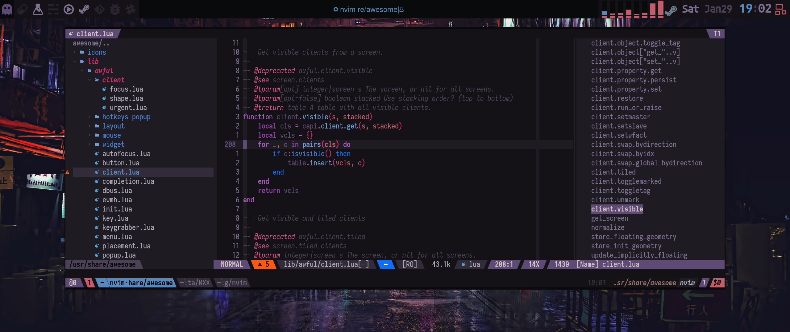

# mxcolr-v2 ▲

<p align="center">
  
</p>
<p align="center">
  
</p>

Usage
=====
    chmod +x mxcolr
    mxcolr <strategy> | <vivid, lch_hue> Default is lch_hue

### every file in `./templates/{tpl}` will be parsed;
### scheme variables replaced; and placed in `./out/{tpl}`


`SBG`, `WBG`, `EBG` are trio of randomely generated colors, they are the core of the palette
> Given the same `seed`, its guaranteed the same `scheme file` be produced.

Possible variables available in all templates or plugins are:
```bash
C00 C01 C02 C03 C04 C05 C06 C07 C08 C09 C10 C11 C12 C13 C14 C15
    CX1 CX2 CX3 CX4 CX5 CX6 # extra saturated
    CY1 CY2 CY3 CY4 CY5 CY6 # extra desaturated
    CF1 CF2 CF3 CF4 CF5 CF6 # fg color on CX bg

SBG WBG EBG # seed bg colors
SFG WFG EFG # seed fg colors

SK0 SK1 SK2 SK3 SK4 SK5 SK6 SK7 SK8 SK9 # S shades
WK0 WK1 WK2 WK3 WK4 WK5 WK6 WK7 WK8 WK9 # W shades
EK0 EK1 EK2 EK3 EK4 EK5 EK6 EK7 EK8 EK9 # E shades

XBG # main bg colors
XFG # main fg colors
```

Requirements
------------
- [pastel](https://github.com/sharkdp/pastel)
- [GNU bc](https://www.gnu.org/software/bc)

## this project is the version 2 of [mxcolr](https://github.com/metaory/mxcolr)

## V2 Roadmap
- [ ] plugin mechanics
- [ ] interactive mode
- [ ] snapshots
- [ ] demos

